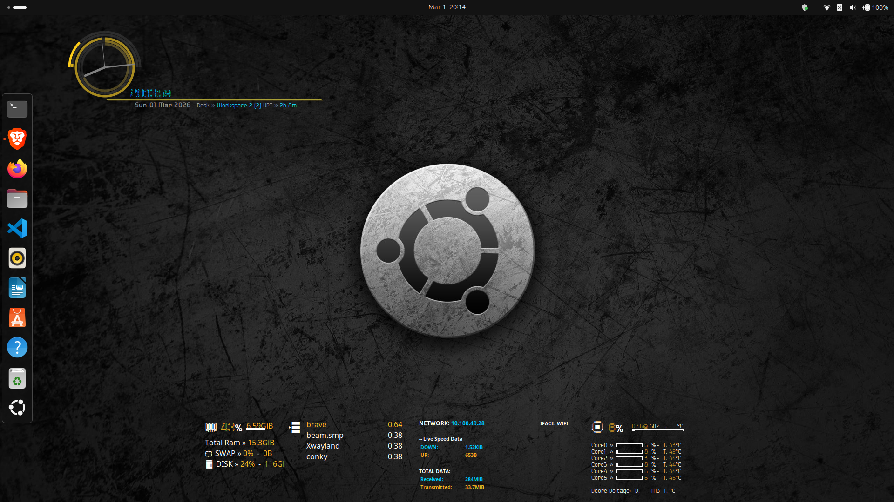

# Ubuntu Conky Widgets Theme

A custom Conky-based desktop widget setup for Linux.

---

## 🖥 Requirements

- Any Linux distribution (Debian/Ubuntu-based recommended)
- `conky-all` package

---

## 📦 Installation

### Step 1: Install Conky

```bash
sudo apt update
sudo apt install conky-all
```
### Step 1: Set-up
-from Terminal
```bash
pkill conky   
~/widgets-theme/scripts.sh 
```
- too start the theme at booting 
add the file in "Startup Applications" with the command "~/widgets-theme/scripts.sh"

